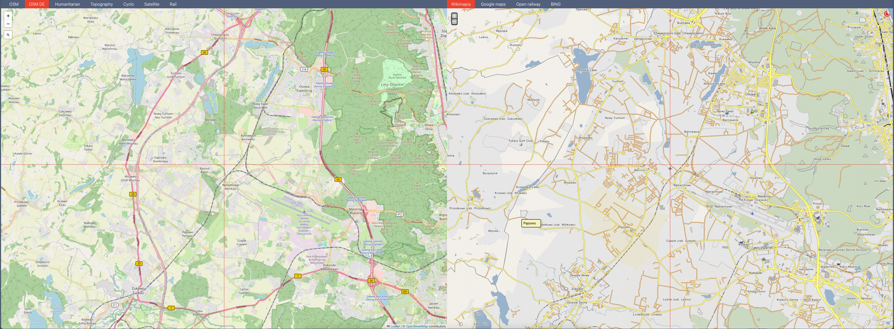

# Dualmap #

Just a side by side map browser - [https://bigismall.github.io/dualmap/](https://bigismall.github.io/dualmap/)

Synchronize views of different map types side by side. Compare data from different sources.

## Keys ##
- `1` - turn on/off the red axis
- `2` - insert Google Maps URL you want to navigate to

